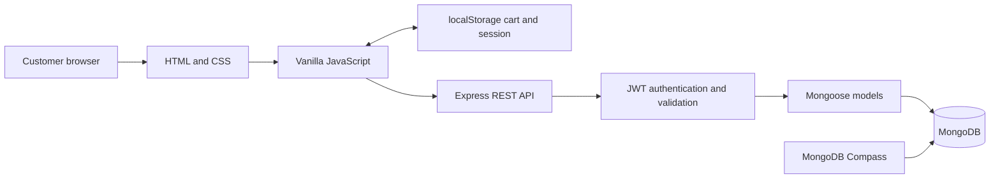

<div align="center">

# Simple Store — E-Commerce Website

**Everyday essentials, organized around a simple shopping experience.**

Developed by **[Sheheryar Ahmad](https://github.com/Sheryar-Ahmad)**

CodeAlpha Full Stack Development Internship · October 2026

[Explore the code](https://github.com/Sheryar-Ahmad/CodeAlpha_Simple-E-Commerce-Store) · [Run locally](#getting-started) · [Feature roadmap](#roadmap)

</div>

---

## Project overview

**Simple Store is a full-stack e-commerce learning project built with HTML, CSS, JavaScript, Node.js, Express, and MongoDB.** Customers can browse everyday essentials, manage a cart, register or sign in, and place cash-on-delivery orders with persistent storage.

The catalog includes an Everyday Backpack, Study Notebook, and Desk Lamp, priced in Pakistani rupees (PKR). The project follows a purchase from product discovery to an authenticated order confirmation, keeping frontend interactions separate from backend validation and database operations.

Built for **Task 1: Simple E-Commerce Store** in the CodeAlpha Full Stack Development internship. The frontend uses vanilla JavaScript and has no build step; React is not used.

> **Current status:** runnable locally with MongoDB. Online payments, email notifications, and admin tools are optional extensions outside the learning scope. See [current limitations](#current-limitations) before using this as a real store.

## Contents

[Features](#features) · [Getting started](#getting-started) · [Configuration](#configuration) · [Architecture](#architecture) · [API reference](#api-reference) · [Testing](#testing) · [Roadmap](#roadmap)

## Features

| Area | What works |
| --- | --- |
| Storefront | Seven connected pages, product imagery, descriptions, and product detail anchors |
| Shopping cart | Add, remove, clear, and edit quantities; browser persistence; PKR totals and delivery charge |
| Accounts | Registration, login, bcrypt password hashing, JWT authentication, and logout |
| Checkout | Required delivery fields, protected order submission, and prices recalculated by the backend |
| Confirmation | Fetches the saved order from the API and checks customer ownership before displaying it |
| Database | Mongoose models for products, users, and orders; product seeding; customer order indexes |
| Interface | Responsive layouts, labelled forms, visible keyboard focus, skip links, and reduced-motion support |
| Error handling | Form feedback, invalid-order checks, duplicate-email handling, and readable startup errors |

The project is useful for studying how a plain JavaScript storefront communicates with an Express REST API and how MongoDB stores customer and order data. It is intentionally small enough to trace the complete purchase flow in code.

## Getting started

### Prerequisites

- Node.js and npm. The project has been run with Node.js 20.19.2.
- MongoDB Server running locally on port `27017`; Compass is an optional database viewer.
- Python with the Windows `py` launcher to serve the frontend locally.
- Git, PowerShell, and a modern browser for the steps below.

### 1. Clone and install

Run in **Windows PowerShell**:

```powershell
git clone https://github.com/Sheryar-Ahmad/CodeAlpha_Simple-E-Commerce-Store.git
cd CodeAlpha_Simple-E-Commerce-Store
cd server
npm ci
```

### 2. Configure the backend

For a fresh clone, copy the example configuration:

```powershell
Copy-Item .env.example .env
```

If `.env` already exists, edit it instead of overwriting it. Set `MONGODB_URI` to your local database and replace the `JWT_SECRET` placeholder with a long random value. Generate one locally with:

```powershell
node -e "console.log(require('crypto').randomBytes(32).toString('hex'))"
```

Paste the result into `server/.env`. Set `CLIENT_ORIGIN=http://localhost:5501` to match the frontend address. Keep the real `.env` private; Git ignores it.

### 3. Seed the catalog and start the backend

With MongoDB running, from `server/`:

```powershell
npm run seed
npm run dev
```

**Seed warning:** the current seed script deletes existing products before inserting the sample catalog. Use it for initial setup, not as a routine restart command.

Expected startup messages:

```text
MongoDB connected: simple_store
Simple Store API running on port 5001
```

### 4. Start the frontend

Open a **second terminal** and change to the repository root:

```powershell
py -m http.server 5501 --bind 127.0.0.1
```

Open **[http://localhost:5501/index.html](http://localhost:5501/index.html)**. Keep both terminals open. Run the frontend command from the folder containing `index.html`; serving its parent folder causes missing-page errors.

### 5. Try the purchase flow

1. Add a product and open Cart.
2. Edit quantities and review the total.
3. Register or log in, then complete the delivery form.
4. Place the order and review its confirmation.
5. Refresh confirmation to retrieve the saved order again.
6. In Compass, connect to `mongodb://127.0.0.1:27017` and inspect `simple_store`.

For a temporary demo without MongoDB, run `npm run dev:memory` inside `server/`. Its accounts and orders disappear when the process stops. For persistent storage, leave `USE_MEMORY_DB` unset or set it to `false` and use `npm run dev`.

## Configuration

Configuration lives in `server/.env`; the committed template is [server/.env.example](server/.env.example).

| Variable | Purpose | Example / behavior |
| --- | --- | --- |
| `PORT` | API listening port | `5001`; keep the frontend API URL in sync if changed |
| `NODE_ENV` | Controls error detail | `development`; production responses omit stack traces |
| `MONGODB_URI` | Database connection | `mongodb://127.0.0.1:27017/simple_store` |
| `JWT_SECRET` | Signs login tokens | Required; replace the example placeholder |
| `JWT_EXPIRES_IN` | Token lifetime | `7d` default |
| `CLIENT_ORIGIN` | Allowed frontend origin | `http://localhost:5501` for the local frontend |
| `USE_MEMORY_DB` | Temporary demo storage | `true` enables memory storage; leave unset or `false` for MongoDB |

The frontend's `API_BASE_URL` is currently defined in [assets/js/main.js](assets/js/main.js) as `http://localhost:5001/api`. The API also allows the local development origins on ports `5500` and `5501`.

## Architecture



The cart is stored in the browser. Checkout sends product identifiers, quantities, and delivery details to the backend. The backend authenticates the customer, validates input, looks up product prices, and saves the order. Confirmation retrieves the order through an ownership-protected endpoint.

Order items store a snapshot of names and prices, so later product edits do not rewrite an existing order's purchase details. Passwords are hashed before storage and excluded from authentication responses.

### Technology stack

| Layer | Technologies |
| --- | --- |
| Frontend | Semantic HTML5, CSS Grid/Flexbox, custom properties, vanilla JavaScript, Fetch API |
| API | Node.js, Express, JWT, bcryptjs, validator |
| Data | MongoDB, Mongoose |
| Request protection | Helmet, CORS, request size limits, rate limiting |
| Development | npm, nodemon, Git |
| Tests | Node.js built-in test runner, HTTP requests, local MongoDB |

### Repository structure

```text
CodeAlpha_Simple-E-Commerce-Store/
├── index.html                     # Catalog and homepage
├── product.html                   # Product detail sections
├── cart.html
├── checkout.html
├── order-confirmation.html
├── login.html / register.html
├── assets/
│   ├── css/style.css               # Shared styles and responsive layouts
│   ├── js/main.js                  # Cart, accounts, checkout, confirmation
│   └── images/                     # Original product and banner PNGs
├── server/
│   ├── .env.example
│   ├── package.json / package-lock.json
│   ├── src/
│   │   ├── app.js / server.js
│   │   ├── config/                 # Database connection
│   │   ├── controllers/            # Request handling
│   │   ├── middleware/             # Authentication and errors
│   │   ├── models/                 # Product, User, Order
│   │   ├── routes/                 # API endpoints
│   │   ├── data/                   # Catalog and demo memory store
│   │   ├── seed/                   # Sample product setup
│   │   └── utils/                  # Token creation
│   └── test/api.test.js
├── docs/
│   ├── BACKEND_GUIDE.md
│   └── FIXES_AND_TESTING.md
├── LICENSE
└── README.md
```

## API reference

Base URL: `http://localhost:5001/api`. Send JSON for POST requests. Protected routes require `Authorization: Bearer <token>`.

| Method | Path | Authentication | Purpose |
| --- | --- | --- | --- |
| GET | `/api` | Public | API index |
| GET | `/api/health` | Public | API response health |
| GET | `/api/products` | Public | Active products |
| GET | `/api/products/:slug` | Public | Product details |
| POST | `/api/auth/register` | Public | Register with `fullName`, `email`, and `password` |
| POST | `/api/auth/login` | Public | Log in with `email` and `password` |
| GET | `/api/auth/me` | Required | Current customer |
| GET | `/api/orders` | Required | Customer's saved orders |
| POST | `/api/orders` | Required | Submit items and shipping address |
| GET | `/api/orders/:id` | Required | Retrieve an order owned by the customer |

Registration passwords must be 12–128 characters. Orders accept whole quantities from 1 to 10 per product. Cash on delivery is the supported payment method; the server calculates the price and PKR 200 delivery charge.

Example order body:

```json
{
  "items": [{ "slug": "backpack", "quantity": 1 }],
  "shippingAddress": {
    "fullName": "Example Customer",
    "phone": "03001234567",
    "street": "Example Street",
    "city": "Islamabad",
    "region": "ICT",
    "postalCode": "44000",
    "country": "Pakistan"
  },
  "paymentMethod": "cash-on-delivery"
}
```

Check the API in PowerShell:

```powershell
Invoke-RestMethod http://localhost:5001/api/health
```

A responding health endpoint does not prove the full purchase flow works. Verify checkout and stored orders as well.

## Testing

From `server/`, with local MongoDB running:

```powershell
npm test
```

The integration test creates a separate temporary database and removes it afterward. It checks registration, login, duplicate emails, protected routes, invalid quantities, server-calculated totals, order ownership, malformed JSON, and persistence after reconnecting. It does not replace browser or deployment testing.

Manual checks:

- Add products, edit quantities, remove items, and clear the cart.
- Register, log out, and log in; check navigation and form errors.
- Submit an incomplete checkout, then place a valid order.
- Refresh confirmation; log out and refresh again to check private order display.
- Check narrow-screen layouts, keyboard focus, and missing assets in browser tools.

See [fixes and testing](docs/FIXES_AND_TESTING.md) for the detailed walkthrough.

### Development commands

Run npm commands inside `server/`:

| Command | Purpose |
| --- | --- |
| `npm run dev` | MongoDB API with nodemon |
| `npm start` | API without automatic restart |
| `npm run dev:memory` | Temporary memory API with nodemon |
| `npm run start:memory` | Temporary memory API without automatic restart |
| `npm run seed` | Replace products with the sample catalog |
| `npm test` | MongoDB API integration test |

There is no frontend build command, lint script, Docker configuration, or CI workflow in this repository.

## Current limitations

- **Fixed frontend catalog:** browsing uses static markup and a JavaScript catalog. Editing database products or prices does not automatically update browsing content; checkout prices come from MongoDB.
- **Inventory:** stock is checked but not reduced or reserved. Concurrent stock allocation needs additional implementation.
- **Payments and operations:** cash on delivery only; no payment gateway, email delivery, admin dashboard, or customer order-history screen.
- **Session security:** JWTs use browser localStorage. Production authentication, token handling, and network configuration need review.
- **Learning scope:** designed to run locally. Deployment is optional and is not part of the completion checklist.
- **Assets and accessibility:** original PNGs are retained; image optimization, formal accessibility assessment, and cross-browser testing remain.

## Roadmap

- [x] Semantic storefront and account pages
- [x] Shared responsive CSS and product imagery
- [x] Browser cart and JavaScript shopping interactions
- [x] Express authentication, MongoDB models, and saved orders
- [x] MongoDB integration tests and ownership-checked confirmation

The core learning scope is implemented. Before submitting, complete the manual browser checks above and record the required project explanation video. These are review and submission steps, not missing deployment features.

Optional future extensions: API-driven browsing, inventory reservation, an admin dashboard, and email notifications. Deployment can be explored later.

## Documentation and contributions

Read the [backend guide](docs/BACKEND_GUIDE.md) for a beginner-friendly explanation and [fixes and testing](docs/FIXES_AND_TESTING.md) for practical verification steps.

For a proposed change, fork the repository, create a focused branch, explain the behavior being changed, run relevant tests, and open a pull request. Use clear commit messages such as `fix: handle invalid order quantities`. Keep secrets and generated learning files out of commits.

## License

Licensed under the [MIT License](LICENSE). Copyright ? 2026 Sheheryar Ahmad. You may use, modify, and distribute the project under the terms in that file.

## Author

**Sheheryar Ahmad**<br>
Software Engineering student at COMSATS University Islamabad<br>
Full Stack Development Intern at CodeAlpha · October 1–30, 2026

[GitHub profile](https://github.com/Sheryar-Ahmad) · [Project repository](https://github.com/Sheryar-Ahmad/CodeAlpha_Simple-E-Commerce-Store)

---

<div align="center">

<strong>Simple Store</strong><br>
A CodeAlpha Full Stack Development project by Sheheryar Ahmad.

</div>
